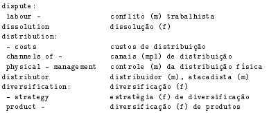
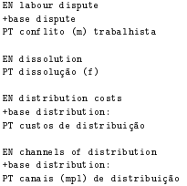
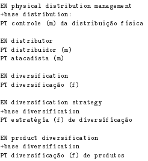

# Reverse Engineering of a Business Dictionary
Assignment of Language Processing (Compilers) subject in Informatics Engineering Masters at University of Minho, Portugal.

## Description
The input data was extracted from a pdf version of a business dictionary. But the data is hard to view and to use search tools on it.



The output goal is to process this structure input and make it looks like this:

|  |   |
|-|-|

## Implementation
Usually in structure text processing two tools are necessary: a parser and a lexical analyser. To construct the solution, we used YACC/BISON to construct the grammar and generate the parser. To tokenize the input we use LEX/FLEX, as lexical analyser.

If the data doesn't have the proper expected input, the grammar will fail and write on the output file that it couldn't recognize that input and write where the error happened. Erros doesn't stop the processing, is only sttoped at the end of file.

It also prints on the screen the amount of erros it found during the processing of the input data.

## Source Code 

The source code of the application can be found in the [Source](src/) Folder.

The folder contains the grammar specification in the dictionary.y file, the lexical analyser in dictionary.l file, the input data at dic-finance-en.pt.txt, a short input file we made for testing and visualize the program working in toy-dic.txt and a Makefile.

## Usage 

After downloading or cloning the repository, you just need to open a shell terminal and type:

```sh
$ cd src/
$ make
 ```
It will automatically compile the code, insert the input data (dic-finance-en.pt.txt) and output a new file called output.txt .

If you want to try the compiled program in another input, as toy-dic.txt, just type:
```sh
$ ./dictionary < toy-dic.txt
```

The Makefile also contain two other methods to clean the working directory. One of them clean the intermediary files and leave the compiled program. And the other clean it all, leaving only the original files. To use them type in the console:

```sh
$ make clean
or
$ make force-clean
```

## Final Comments

We thanks and welcome any suggestion or pull-request to improve the code.

Feel free to use this code as you want, except if you have a similar assignment. In this case, make an effort to do your own.

Any doubts about it, send me an [e-mail](mailto:higoress@gmail.com).

## Authors

> Higor Emanuel [GitHub](www.github.com/higoress) 

> João Monteiro [GitHub](www.github.com/johnnymonteiro)
